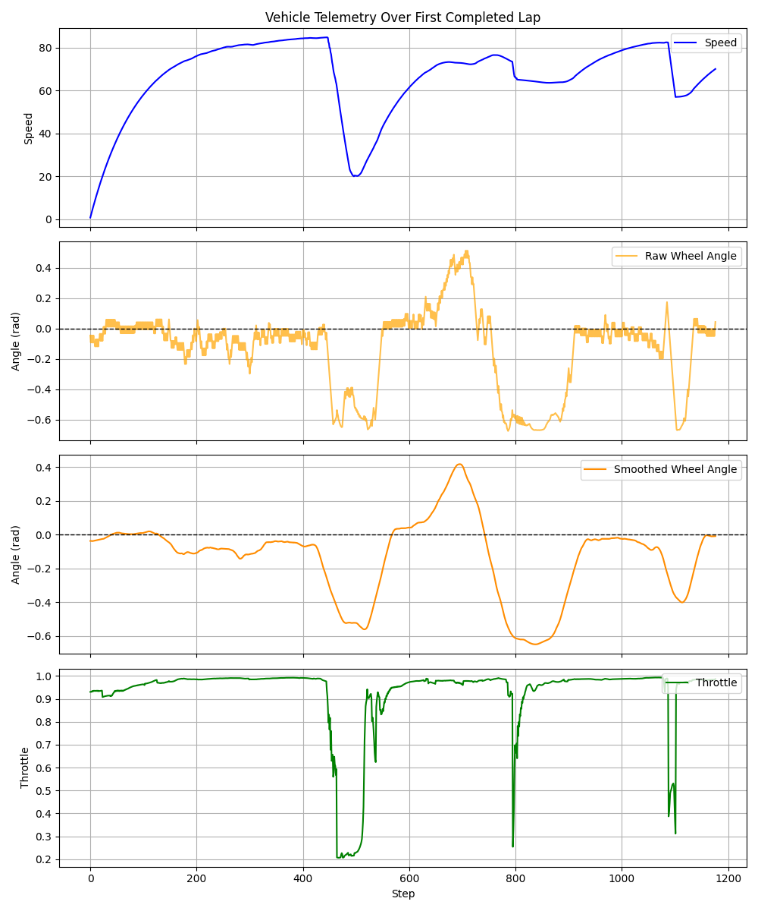
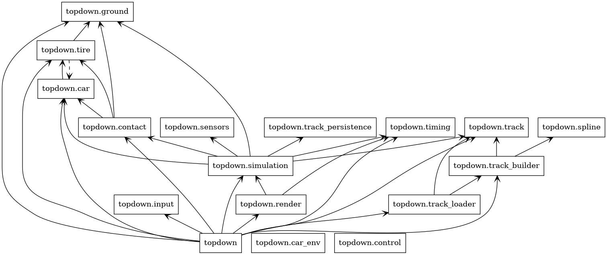

# Drivetrain

A top-down car driving simulator with realistic Box2D tire physics, built as a reinforcement learning sandbox. Train a SAC agent to drive a circuit autonomously, or take the wheel yourself.



## Features

- **Realistic physics** — four-wheel drive model with lateral/longitudinal tire friction, surface traction, and smooth steering interpolation
- **RL-ready gymnasium environment** — 15-dim observation space, continuous action space, reward shaped around heading and centerline distance
- **SAC training** — trains with Stable Baselines3 across 4 parallel environments; ROCm/AMD GPU support out of the box
- **Spline-based track system** — define circuits as Catmull-Rom control points; the engine builds Box2D polygon meshes automatically
- **Interactive track editor** — sketch new circuits by clicking control points with a live preview
- **Lap timing** — per-sector splits, best-lap tracking, and HUD display

## Installation

Requires Python 3.12+ and [`uv`](https://github.com/astral-sh/uv).

```bash
git clone https://github.com/gergokaposvari/Drivetrain
cd Drivetrain
uv sync
```

## Usage

### Drive it yourself

```bash
uv run python main.py --track simple        # drive a bundled track
uv run python main.py --list-tracks         # show all available tracks
uv run python main.py --show-sensors        # visualise the 7 raycast sensors
```

### Train an agent

```bash
uv run python ppo_train.py
```

Trains a SAC agent for 1 M timesteps across 4 parallel environments. The model is saved to `dist_to_sector_sb3_sac.zip`.

### Watch the trained agent

```bash
uv run python ppo_agent_plays.py
```

Loads the saved model, renders a lap, and writes `lap_telemetry.png` with speed, steering, and throttle traces.

### Build a new track

```bash
uv run python -m src.editor.track_editor --output tracks/my_track.json
```

- **Left click** — add a control point (default width: 20 m)
- **Right click / Z** — remove the last point
- **S** — save (requires ≥ 4 points)

Tweak widths afterwards by editing the JSON directly.

## RL Environment

| | |
|---|---|
| **Observation** (15-dim) | 10 raycast distances (0–150 m) + speed, wheel angle, next-sector unit vector (x, y), tyres on grass |
| **Action** (2-dim) | steering ∈ [−1, 1], throttle ∈ [0.2, 1] |
| **Reward** | `v × (cos α − d)` where `v` = forward speed, `α` = heading error, `d` = normalised centreline distance |
| **Termination** | all 4 tyres on grass → −10 reward |
| **Episode cap** | 3 000 steps |

### Network architecture (SAC)

```mermaid
graph TD
    subgraph Actor["Actor Network (Policy)"]
        direction TB
        A_Input[("Input: Observation (15)")]
        A_H1["Hidden Layer 1 (Linear 256 + ReLU)"]
        A_H2["Hidden Layer 2 (Linear 256 + ReLU)"]
        subgraph Heads["Output Heads"]
            A_Mean["Mean μ (2)"]
            A_Std["Log Std σ (2)"]
        end
        A_Sample(Gaussian Sampling)
        A_Tanh(Tanh Activation)
        A_Out[("Output: Action (2) — Throttle, Steering")]
        A_Input --> A_H1 --> A_H2 --> A_Mean --> A_Sample
        A_H2 --> A_Std --> A_Sample --> A_Tanh --> A_Out
    end

    subgraph Critic["Critic Network (Q-Function)"]
        direction TB
        C_InputObs[("Input: Observation (15)")]
        C_InputAct[("Input: Action (2)")]
        C_Concat{Concatenate (17)}
        C_H1["Hidden Layer 1 (Linear 256 + ReLU)"]
        C_H2["Hidden Layer 2 (Linear 256 + ReLU)"]
        C_Out[("Output: Q-Value (1)")]
        C_InputObs --> C_Concat
        C_InputAct --> C_Concat
        C_Concat --> C_H1 --> C_H2 --> C_Out
    end
```

## Track format

Tracks are JSON files in `tracks/`. The spline format:

```json
{
  "spawn_point": [-150.0, -70.0],
  "spawn_direction": [0.83, 0.55],
  "control_points": [
    [-150.0, -70.0], [-40.0, -120.0], [70.0, -90.0],
    [130.0, 0.0],   [60.0, 90.0],   [-40.0, 100.0],
    [-140.0, 40.0], [-180.0, -40.0]
  ],
  "widths": [60.0, 60.0, 50.0, 55.0, 60.0, 55.0, 60.0, 60.0]
}
```

`control_points` and `widths` must have the same length (≥ 4). Width values are in metres.

Optional keys: `samples_per_segment` (default `8`), `road_friction`, `grass_friction`, `margin`.

## Module overview



| Module | Role |
|---|---|
| `car_env.py` | Gymnasium wrapper — obs, action, reward, reset |
| `simulation.py` | Box2D world — physics stepping, geometry, contact |
| `car.py` / `tire.py` | Vehicle chassis and friction-based tyre model |
| `sensors.py` | 7-ray fan raycasts, max 150 m |
| `track_loader.py` / `track_builder.py` | JSON → Catmull-Rom spline → Box2D polygons |
| `timing.py` | Sector and lap timing with best-time tracking |
| `render.py` | Pygame renderer — track, car, sensors, HUD |
| `editor/track_editor.py` | Interactive circuit sketching tool |

## Development

```bash
uv run pytest                        # run tests
uv run black src/ tests/             # format
uv run ruff check src/ tests/ --fix  # lint
uv run mypy src/ tests/              # type-check
```

Pre-commit hooks (black, ruff, mypy, commitizen) run automatically on `git commit`.
